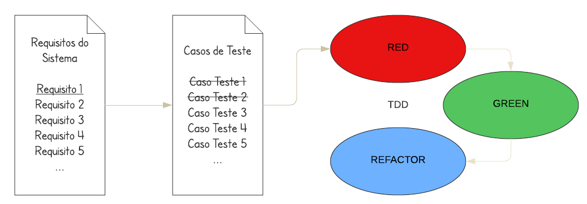
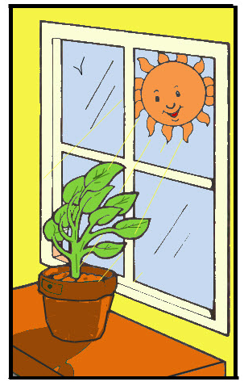

# TDD – Desenvolvimento de Software Guiado por Testes - ITA

Repositório referente ao conteúdo de estudos do curso TDD – Desenvolvimento de Software Guiado por Testes
oferecido pelo Instituto Tecnológico de Aeronáutica (ITA)

### Semana 1

_What if we could test our steps before actually making our decisions?_

Na vida real, infelizmente, não é possível utilizar dessa estratégia para tomar nossas decisões. Porém, quando se trata no desenvolvimento/escrita de códigos é possível aplicar essa estratégia.
  
O TDD na sua essência nada mais significa escrever o teste antes mesmo do desenvolvimento do código, o que na verdade serve como orientação de como o código precisa se "comportar".

 

**E como seria um ciclo de desenvolvimento utilizando TDD?**

  

De forma simplificada, o primeiro passo é escrever testes que irão falhar e está tudo bem, até por que não temos o corpo do código para que os testes de fato possam avaliar.
  
O segundo passo é começar a escrever o corpo do código para que os testes passem.
  
O terceiro passo é refatorar buscando a melhoria do código e verificando o comportamento dos testes a cada alteração.
Esse ciclo irá se repetir até que o código alcance o nível de satisfação, apresentando uma boa estrutura e preferencialmente seguindo as boas práticas de um código/arquitetura limpa.

[Hands on!](https://github.com/Lukasveiga/curso-tdd-ita/tree/main/src/tdd/ita/semana01/handson)

### Semana 2

<i>O chapéu do TDD</i>

A ideia principal do chapéu é a de realizar as etapas do TDD de cada vez. Ou seja, você não pode/deveria usufruir da "sombra" de todas as abas do chapéu de uma só vez.
  
Relembrando:
  
🔴 Na etapa vermelha temas a construção de testes que irão falhar, nesse momento é iniciada a construção das "diretrizes" que as funções/classes precisam respeitar.
  
🟢 Já na etapa verde, temos a construção do código mais simples possível e consiga passar nos testes estabelecidos na etapa vermelha.
  
🔵 Na etapa azul, que não necessariamente representa o fim do ciclo, temos a refatoração do código, que a princípio não foi desenvolvido seguindo boas práticas de código/arquitetura limpa. O que faz sentido, pois na etapa verde o objetivo principal é de que o código respeite os comportamentos estabelecidos pelos testes, sem se importar com a qualidade do código.
Nesse momento é realizada toda refatoração necessária para se alcançar um código de qualidade e tendo os testes como segurança de que o comportamento esperado permaneça a cada alteração.

[Hands on!](https://github.com/Lukasveiga/curso-tdd-ita/tree/main/src/tdd/ita/semana02/handson)

_Além do código!_

Além dos benefícios relacionados ao desenvolvimento do código, o TDD também traz vantagens intrinsecamente relacionadas ao desenvolvimento ágil, sendo elas:

1. Feedbacks rápidos;
2. Aprendizado contínuo;
3. Foco em soluções simples e funcionais;
4. Soluções evolutivas e adaptativas;

<i>Are you smelling this <b>bad smell</b>?</i>

<i>Bad smell</i> ou na tradução mau cheiro, são coisas que suspeitamos não estar muito bem no código. Ou que vai causar algum tipo de preocupação no futuro, caso não sejam corrigidos.
  
E o que seriam esse maus cheiros, por exemplo?
<ul>
    <li>Nomes inadequados</li>
    <li>Código duplicado</li>
    <li>Métodos grandes - Muitas responsabilidades</li>
    <li>Classes grandes (God Classes)</li>
    <li>Comandos If e Switch (Obs: Em excesso)</li>
    <li>Inveja de Característica</li>
    <li>Intimidade Imprópria</li>
    <li>Comentários</li>
</ul>

Ok, encontrei a fonte do _bad smell_. Mas, e agora?

Vamos refatorar! (Com a segurança, garantida pelos testes, de que não iremos alterar o comportamento do código)

1. Precisamos listar a fonte do 'mau cheiro';
2. Escolher a técnica de refatoração;
3. Aplicar a técnica de refatoração escolhida;
4. Testar o código refatorado;

Realizar os seguintes passo até que o 'mau cheiro' seja eliminado do código.

### Semana 3

Bom, num ciclo TDD não podemos ir direto colocar as mãos na massa. É necessário levantar as responsabilidades do sistema e também os casos de teste.
  
Relembrando que no levantamento dos requisitos devemos evitar a abordagem BDUF (Big Design Up-front) e sim utilizar da abordagem EDUF (Enough Desing Up-front), de forma que tenhamos uma boa base para as construções dos casos de teste sem que seja necessário idealizar todos os pontos e detalhes do projeto, contribuindo assim para o desenvolvimento ágil.
  
<ul align="justify">
    <li><i><b>Big design up front</b> é uma abordagem de desenvolvimento de software na qual o design do programa deve ser concluído e aperfeiçoado antes que a implementação desse programa seja iniciada.</i></li>
<li><i><b>Enough design up front</b> é uma abordagem que diz que a quantidade certa de design é suficiente para criar bases sólidas para um produto de software e sua entrega</i></li>
</ul>

Após o levantamento dos requisitos é necessário determinar os casos de teste, tanto os casos positivos quanto os casos negativos.
 
E iniciar o ciclo do TDD para cada requisito com seus casos de teste como representado no diagrama abaixo:

 

<b><i>Maaaas e se minha classe tiver dependências??</i></b>

Quando realizamos o teste de uma classe em que existe uma dependência de outra classe, sem utilizar nenhum método de isolamento, perdemos a essência do teste unitário e passamos a ter um teste de integração.  
Mas o que pode tornar isso um problema?
<ol>
  <li>A dependência pode demorar a executar</li>
   
  <li>A dependência pode depender da infraestrutura</li>
   
  <li>A dependência pode ter um comportamento complexo</li>
</ol>
 
Todos esses fatores influenciam na dificuldade de escrever os testes como também no tempo de execução, lembrando que durante o desenvolvimento utilizando TDD os testes são executados inúmeras vezes. 
  
<b><i>Ok. Qual seria a solução então?</i></b>
  
O TDD pode definir não somente a interface interna, mas também a interface das dependências. Porém, essas dependências precisam ser abstrações da implementação real, no mundo Java poderemos utilizar as interfaces para alcançar esse comportamento.  
Uma vez definidas as dependências de forma abstrata da classe, podemos utilizar um Mock Object. Esse Mock Object é um objeto simulado que copia o comportamento de um objeto real de forma controlada.

<u>Diretivas de um Mock Object:</u>
  
<ul>
  <li>Imitar a interface da dependência</li>
  <li>Simular o comportamento do cenário de test</li>
  <li>Verificar as chamadas esperadas da classe</li>
</ul>

